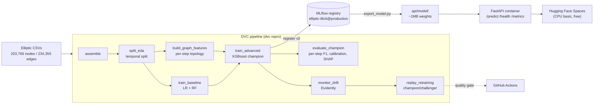

# EllipticGuard

An anti-money-laundering (AML) illicit-transaction detector on the [Elliptic Bitcoin dataset](https://www.kaggle.com/datasets/ellipticco/elliptic-data-set), built as a deployable, monitored, reproducible ML system rather than a notebook.

Classical ML on engineered causal graph-topology features, validated on an honest temporal split, served as a FastAPI container, with drift monitoring and a replayed retraining loop.

**Headline result:** illicit-class **F1 = 0.806**, AUC-PR = 0.800 on a strictly future test window (time steps 35–49) — and a per-time-step curve showing that model collapsing to F1 ≈ 0.03 at time step 43, which monitoring detects and retraining cannot fix.

## Honest stance

There is no live Bitcoin feed. The 49 time steps are fixed and historical. "Retraining" here is an explicit **replay** of streaming — time steps are fed in sequence to simulate it. What this project demonstrates is that monitoring *detects* drift and the loop *responds*; it also shows the case where retraining does **not** recover (T43) and argues the correct response there is human escalation, not another training run.

Every metric below is a real measured value from a real run. Where a result was worse than hoped, it is reported as-is (see the graph-features result under [Results](#results)).

## Architecture



## Reproduce from a clean clone

Python 3.11+ (developed on 3.13.3). CPU-only throughout — no GPU required.

```bash
git clone <this-repo> && cd EllipticGuard
python -m venv .venv && .venv/Scripts/activate      # Linux/macOS: source .venv/bin/activate
pip install -r requirements.txt
```

**Get the data** (not in git — ~200 MB, DVC-tracked). Download the three CSVs from [Kaggle](https://www.kaggle.com/datasets/ellipticco/elliptic-data-set) into `data/raw/`:

```
data/raw/elliptic_txs_features.csv     # 203,769 x 167, NO header
data/raw/elliptic_txs_classes.csv      # 203,769 x 2, has header
data/raw/elliptic_txs_edgelist.csv     # 234,355 x 2, has header
```

**Run everything** — one command reproduces the full pipeline end to end:

```bash
dvc repro          # assemble -> split_eda -> train_baseline -> build_graph_features
                   # -> train_advanced -> evaluate_champion -> monitor_drift -> replay_retraining
pytest             # 27 tests
```

**Serve locally:**

```bash
python pipelines/promote_model.py            # point elliptic-illicit@production at the champion
uvicorn src.serving.app:app --reload
curl localhost:8000/health
```

**Build the container** (what Hugging Face Spaces runs — verified serving a real illicit row at p=0.9946 and a real licit row at p=0.0253, with no MLflow registry inside the container):

```bash
python pipelines/export_model.py             # alias -> api/model/ weights
docker build -t ellipticguard .
docker run -p 7860:7860 ellipticguard
curl localhost:7860/health                   # {"status":"ok","model_version":"2"}
```

## Results

All figures measured on the **test window (time steps 35–49)**, which is strictly later than anything the model saw. Illicit-class F1 is the headline metric — accuracy is never reported, as ~90% of labeled nodes are licit.

| Model | Illicit F1 | AUC-PR | Precision | Recall |
|---|---|---|---|---|
| Logistic Regression (166 provided features) | 0.245 | 0.204 | 0.140 | 0.947 |
| Random Forest — registry v1 | 0.752 | 0.770 | 0.849 | 0.675 |
| **XGBoost, provided features — registry v2 (champion)** | **0.806** | **0.800** | 0.891 | 0.735 |
| XGBoost, provided + 7 graph-topology features | 0.797 | 0.802 | 0.871 | 0.735 |
| GraphSAGE (mean-agg, plain PyTorch, optional Layer 8) | 0.565 ± 0.008 | 0.531 | — | — |
| GCN (plain PyTorch, optional Layer 8) | 0.554 ± 0.033 | 0.558 | — | — |
| EvolveGCN (plain PyTorch, optional Layer 8) | 0.120 ± 0.028 | 0.103 | — | — |

Reference: Weber et al. 2019 ([arXiv:1908.02591](https://arxiv.org/abs/1908.02591)) report RF ≈ 0.788 illicit-F1 on the same temporal split. Our RF measured 0.752 and our XGBoost champion 0.806 — reported as measured, not tuned toward their number.

**The graph features did not win.** Seven causal per-time-step topology features (in/out-degree, unique neighbors, PageRank, clustering coefficient, component size, avg neighbor degree) produced a *marginal AUC-PR edge* but slightly **lower** F1 than the provided 166 features alone. The champion was selected on test F1, so the provided-only model won. The likely reason: the dataset's own 72 "aggregated" features already encode one-hop neighborhood information, leaving topology position largely redundant (D-021, D-022).

**GNNs lose to the champion (optional Layer 8).** GCN, GraphSAGE, and EvolveGCN were re-implemented from scratch in plain PyTorch (no PyTorch Geometric — the graph is small enough that hand-rolled sparse adjacency ops run in minutes on CPU), trained under the *exact same* split, features, preprocessor, class weight, and `evaluate()` code as the classical models (mean ± std across 3 seeds each). All three lose to the XGBoost champion — consistent with Weber et al.'s own table, where RF beat every GNN they tried. The table above uses a 200-epoch/patience-20 budget (raised from an initial 60/8 after a diagnostic showed real headroom — see D-032): GCN improved 0.450→0.554 and GraphSAGE 0.496→0.565 with the larger, still-equal-across-models budget, while EvolveGCN reproduced to the exact same 0.120 either way, indicating its ceiling is architectural (the truncated BPTT window) rather than budget-limited. GCN and GraphSAGE still sit well under the published ≈0.628 GCN figure for the same architecture; the remaining gap is a genuine train→test generalization effect, not an implementation bug — the per-time-step curve below shows all three GNNs also collapsing at step 43, independently corroborating the drift story. Full reasoning in `DECISIONS.md` D-030/D-031/D-032.

**Calibration** (test Brier, lower is better): uncalibrated 0.0268 → **0.0264** with sigmoid (isotonic 0.0266). The margin is small enough that the served model returns a raw, honestly-labeled probability rather than a calibrated field borrowed from a different base model (D-023, D-024).

## The T43 drift story

This is the centrepiece.

**Per-time-step illicit-F1 across the test range collapses at step 43:** mean F1 = **0.855** for steps 35–42, mean F1 = **0.028** from step 43 onward — steps 43, 45, and 47 score exactly 0.000. This corresponds to a real event: a darknet-market shutdown that changed what illicit activity looks like on-chain.

What the monitoring found (Layer 9):

- **Feature drift is flat.** Evidently's share-of-drifted-columns fluctuates 0.45–0.76 across steps 30–49 with no trend (corr with time step = 0.06; 0.583 pre-T43 vs 0.605 post-T43). A feature-drift alarm alone would **not** have caught this.
- **Target drift spikes.** The `label` column's drift score averages 0.052 for steps 30–42 vs **0.117** for steps 43–49 — the four highest values in the entire series are steps 43–46. This lines up exactly with the F1 collapse.

That gap is the finding: **the failure was invisible in the feature distribution and only visible in the labels.** A production system relying on label-free feature drift monitoring would have missed it entirely — which is a real monitoring blind spot, not a footnote (D-025).

What the retraining loop found (Layer 10): the replay's drift-or-performance flag fires from step 43 onward, and champion/challenger correctly **promotes** in routine steps (e.g. step 39: challenger F1 0.968 vs champion 0.884) but **holds** at steps 43 and 45, where a challenger trained on everything before the step still cannot beat the champion — both score near zero. Later challengers recover only partially (F1 0.19–0.90) and never approach the ~0.85 pre-collapse level.

**Conclusion: T43 is a regime change, not a staleness problem.** More training data doesn't help when the thing you're detecting has changed shape. The correct response is escalation to a human analyst, and the loop is designed to hold rather than promote a model that merely looks new (D-023, D-026).

## Running the service

**There is no live demo URL yet, and the reason is worth stating plainly:** this project targeted Hugging Face Spaces' free CPU tier, and HF has since moved Docker (and Gradio) Spaces behind a paid plan — only static Spaces remain free, and a static Space has no Python process to run FastAPI in. Rather than quietly swap in another host or drop the requirement, the deployment is postponed and the gate left open (D-029).

What *is* verified: the container serves correctly. Inside a Linux container with no MLflow registry present at all, a real illicit transaction from the test window scores **0.9946** and a real licit one **0.0253**. One command reproduces it from a clean clone:

```bash
docker build -t ellipticguard . && docker run -p 7860:7860 ellipticguard
```

```bash
curl -X POST localhost:7860/predict \
  -H 'Content-Type: application/json' \
  -d '{"features": [/* 166 floats: time_step + feat_0..feat_164 */]}'
```

The real response for a known illicit transaction (txId 70384401, time step 35), copied from an actual container run:

```json
{"illicit_probability": 0.9946, "prediction": 1, "threshold": 0.5,
 "model_name": "elliptic-illicit", "model_version": "2"}
```

Endpoints: `POST /predict` · `GET /health` · `GET /metrics` (request count, p50/p95 latency).

## Limitations

Stated plainly, because each one is a real gap:

- **The deployed container loads weights from a path, not the registry.** Locally, the app resolves `models:/elliptic-illicit@production` — the registry is the source of truth. But `mlflow.db` bakes absolute Windows artifact paths into `model_versions.source`, so the container can't query it; `pipelines/export_model.py` resolves the alias at build time and ships the ~1 MB artifact instead. The alias still decides *what* ships, but the running Space resolves `/app/model`. A hosted MLflow tracking server is the real fix and would remove this entirely (D-028).
- **`PREDICT_THRESHOLD` is 0.5, untuned.** A sensible default, not an operating point chosen from a precision/recall tradeoff.
- **No live deployment yet.** HF Spaces' free tier dropped Docker support mid-build (only static Spaces are free now, and those can't run a server process). The container is verified serving; the host is undecided. Free options all carry a catch worth knowing: Render's free tier spins down after 15 min idle and caps at 512 MB RAM (which would mean loading `model.ubj` via `xgboost.Booster` instead of importing mlflow), while Fly.io and Cloud Run now require a card on file (D-029).
- **No GNN comparison.** Layer 8 (static GCN / EvolveGCN, reference figures ≈ 0.63 / 0.72) was scoped as nice-to-have and skipped in favor of finishing the serving, monitoring, and retraining layers. A clean classical model with honest validation and a live deployment beats a half-finished GNN.
- **The 72 aggregated features are opaque.** They're anonymized by the dataset's publisher, so the SHAP ranking (`feat_52`, `feat_58`, `feat_89` lead) identifies *which* features matter but cannot say what they mean.
- **Unknown-labeled nodes (157,205 of 203,769) are excluded** from supervised training and evaluation. They're kept in the assembled table for graph structure, but the operative class balance is ~9.8% illicit over the 46,564 labeled nodes (D-002, D-016).

## Resume metrics

**Model / statistical**
- Illicit-class F1 **0.806**, AUC-PR **0.800**, precision 0.891, recall 0.735 (test steps 35–49)
- Per-time-step F1 curve with T43 annotation: 0.855 → 0.028
- Calibration: test Brier 0.0268 → 0.0264 (sigmoid)

**System / MLOps**
- Inference latency: **p50 0.73 ms, p95 6.48 ms** (CPU, in-process; target was < 100 ms)
- Model size: **1.1 MB** (target was < 50 MB)
- Reproducibility: `dvc repro` rebuilds the full pipeline from raw CSVs in one command
- Retraining cadence: per replayed time step, gated on a drift-or-performance flag
- Drift detection: target drift spikes at the exact step of the F1 collapse (T43)
- CI: GitHub Actions, data-free (`pytest -m "not needs_data"` + an F1 ≥ 0.6 quality gate)
- Tests: 27 passing, including leakage guards on the temporal split and every fitted transform

## Project documentation

- `PROJECT_PLAN.md` — the layered build plan and per-layer acceptance gates
- `DECISIONS.md` — every non-trivial decision, with alternatives and tradeoffs (D-001…D-028)
- `SESSION_LOG.md` — layer status and per-session gate evidence
